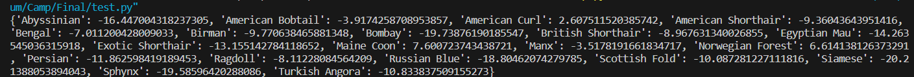

# ML Zoomcamp Capstone: Building a neural network model to classify cat breeds

First & foremost, thanks a lot Alexey Grigorev and the rest of the team and community for such a great opportunity!

Now for the topic: _cats_! A lot of people love them, me included. This repo is about building a NN model to classify cats across 20 breeds! 

## The Dataset

The dataset can be found in the appropriately named "dataset" folder, or on [Kaggle](https://www.kaggle.com/datasets/doctrinek/catbreedsrefined-7k/data).

Looking through it, you'll find these are the breeds we'll work with:

* Abyssinian
* American Bobtail
* American Curl
* American Shorthair
* Bengal
* Birman
* Bombay
* British Shorthair
* Egyptian Mau
* Exotic Shorthair
* Maine Coon
* Manx
* Norwegian Forest
* Persian
* Ragdoll
* Russian Blue
* Scottish Fold
* Siamese
* Sphynx
* Turkish Angora

> Data is explored in the python notebook "data_discovery"

## The Model

We'll be using transfer learning to customize the xception model to our needs. We'll also do some parameter tuning for dense layer size, learning rate, data augmentation and dropout! The training is done on Saturn Cloud, but if you want to do it yourself locally, there's a Pipfile with all the dependencies needed (in the folder "Deployment"). We'll go into how to use a virtual environment next.

## Virtual Environment

We're using Pipenv. We have a Pipfile in the Deployment folder! If you want to use it, make sure you have Pipenv installed (or install it using ```pip install pipenv```), run ```pipenv install``` in the Deployment folder and let the magic happen! It'll automatically generate a lock file.

## Containerization: Docker

Open a terminal in the Deployment folder, and run the following command to build our container:

```Dockerfile
docker build python:3.10-slim .
```

Then, run the container with:

```Dockerfile
docker run -p 9696:9696 python:3.10-slim
```

We can now test the docker with the test.py file and the Maine-Coon image!

If you're interested in the cloud part of this endeavor, we'll need to upload the container on DockerHub; We create a tag and push it as follows:

* First, create the tag, it should contain your username on DockerHub + a custom name for the container

```Dockerfile
docker tag python:3.10-slim username/name-for-app
```

* Now we push it to DockerHub using the tag (_Please make sure you have an account and you're logged in. You'll be prompted to login in case you're not_):

```Dockerfile
docker push username/name-for-app
```

> Remember what we named our tag, we'll use it later!

## Deployment on the cloud using Azure

We can host this container with Azure in what's called "Azure Container App". These can easily allow us to deploy a docker container and expose it to the internet so we can use it with a post request.

I'll be using the GUI on the official website, but you can do this with code if you want ([Here](https://learn.microsoft.com/en-us/azure/container-apps/get-started?tabs=azure-powershell)'s the documentation). We both follow the same steps anyway (Plus, we'll still be using some code).

First, we create a resource group. I named it "capstone".


We create the container app:


The next step is how we set up our image from DockerHub (this is where the tag is used!) then we turn on ingress.


Click on "Review and Create", and then "Create". Wait for deployment...

When it's done, we click on "Go to resource". We can find our application's URL on the right side:


For us, the URL is https://cat-app.livelyriver-2b7eeca9.westeurope.azurecontainerapps.io

We change our test.py file to test the app.

```Python
import requests
# we change the address to our docker app's address
service_url = 'https://cat-app.livelyriver-2b7eeca9.westeurope.azurecontainerapps.io/predict' 

image_path = 'maine-coon.jpg'

with open(image_path, "rb") as file:
    imageData = file.read()
    files = {'file': ('image.jpg', imageData)}
    response = requests.post(service_url, files=files)


if response.status_code == 200:
    predictions = response.json()
    print(predictions)
else:
    print('Error:', response.content)
```

We run it, and it's working!



Since I'm on a tight budget, I'll delete the resource group (and subsequently, all the resources in it)

